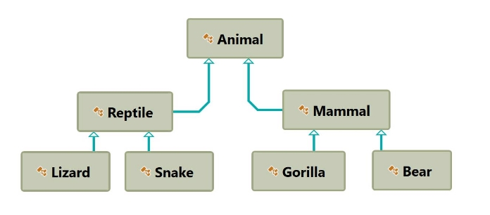
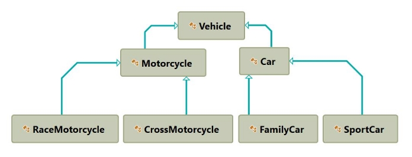


**Exercise: Inheritance** 

1. **Person** 

You are asked to model an application for storing data about people. You should be able to have a person and a child. The child derives from the person. Your task is to model the application.  

- **Person** – represents the base class by which all of the others are implemented. 
- **Child** - represents a class, which derives from **Person.** 

**Note** 

Your class’s names **MUST** be the same as the names shown above!!! 

|**Sample Main()** |
| - |
|
static void Main() 

{ 

`    `string name = Console.ReadLine(); 

`    `int age = int.Parse(Console.ReadLine()); 

`    `Child child = new Child(name, age);     Console.WriteLine(child); 

}
|
Create a new empty class and name it **Person**. Set its access modifier to **public** so it can be instantiated from any project. Every person has a **name**, and an **age**. 

|**Sample Code** |
| - |
|
public class Person { 

`   `// 1. Add Fields 

// 2. Add Constructor // 3. Add Properties // 4. Add Methods 
|
|}|

- Define a **field** for each property the class should have (e.g. **Name**, **Age**)  
- Define the **Name** and **Age** properties of a Person.  

|**Input** |**Output** |
| - | - |
|Peter 13 |Name: Peter, Age: 13 |
2. **Zoo** 

**NOTE**: You need a public class **StartUp**. 

Create a project **Zoo**. It needs to contain the following classes:  

Follow the diagram and create all of the classes. **Each** of them, except the **Animal** class, should **inherit** from **another** **class**. Every class should have: 

- A constructor, which accepts one parameter: **name**.  
- Property **Name - string**. 

Zip your solution without the bin and obj folders and upload it in Judge. 

3. **Players and Monsters** 

NOTE: You need a public class **StartUp**. 

Your task is to create the following game hierarchy:  

Create a class Hero. It should contain the following members: 

- A constructor, which accepts: 
- **username – string** 
- **level – int** 
- The following properties: 
- **Username - string** 
- **Level – int** 
- **ToString()** method 

Hint: Override **ToString()** of the base class in the following way: 

||
| :- |
|
public override string ToString() 

{ 

`    `return $"Type: {this.GetType().Name} Username: {this.Username} Level: {this.Level}"; }
|
4. **Need for Speed** 

NOTE: You need a public class **StartUp**. Create the following **hierarchy** with the following **classes**: 

Create a base class **Vehicle**. It should contain the following members: 

- A constructor that accepts the following parameters: **int horsePower**, **double fuel** 
- **DefaultFuelConsumption – double**  
- **FuelConsumption – virtual double** 
- Per kilometer. 
- **Fuel – double** 
- **HorsePower – int** 
- **virtual void Drive(double kilometers)** 
- The **Drive** method should have a functionality to reduce the **Fuel** based on the travelled kilometers. 

The default fuel consumption for **Vehicle** is **1.25**.** Some of the classes have different default fuel consumption values:** 

- **SportCar – DefaultFuelConsumption = 10**
- **RaceMotorcycle – DefaultFuelConsumption = 8** 
- **Car – DefaultFuelConsumption = 3** 

Zip your solution without the bin and obj folders and upload it in Judge. 

5. **Restaurant** 

NOTE: You need a public class **StartUp**. Create a **Restaurant** project with the following classes and hierarchy: There are **Food** and **Beverages** in the restaurant and they are all products.  

The **Product** class must have the following members: 

- A constructor with the following parameters: **string name, decimal price**
- **Name – string**
- **Price – decimal**

**Beverage** and **Food** classes are products.  

The **Beverage** class must have the following members: 

- A constructor with the following parameters**: string name, decimal price, double milliliters**
- Reuse the constructor of the inherited class
- **Name – string**
- **Price – double**
- **Milliliters – double** 

**HotBeverage** and **ColdBeverage** are beverages and they accept the following parameters upon initialization: **string name, decimal price, double milliliters.** Reuse the constructor of the inherited class.** 

**Coffee** and **Tea** are hot beverages.  

The **Coffee** class must have the following additional members: 

- **Caffeine – double**

The **Coffee** class must have the following default values: 

- **Milliliters = 50** 
- **Price = 3.50**

The **Food** class must have the following members: 

- A constructor with the following parameters**: string name, decimal price, double grams**
- **Name – string**
- **Price – decimal**
- **Grams – double** 

**MainDish**, **Dessert** and **Starter** are food. They all accept the following parameters upon initialization: **string name, decimal price, double grams**. Reuse the base class constructor. 

**Dessert** must accept **one more** parameter in its **constructor**: **double calories**, and has a property: 

- **Calories**

Make **Fish**, **Soup** and **Cake** inherit the proper classes.  

The **Cake** class must have the following default values: 

- **Grams = 250** 
- **Calories = 1000** 
- **Price = 5**

A **Fish** must have the following default values: 

- **Grams = 22** 

Zip your solution without the bin and obj folders and upload it in Judge. 

6. **Animals** 

NOTE: You need a public class **StartUp**. 

Create a hierarchy of **Animals**. Your program should have three different animals – **Dog**, **Frog** and **Cat**. Deeper in the hierarchy you should have two additional classes – **Kitten** and **Tomcat**. **Kittens are female and Tomcats are male.** All types of animals should be able to produce some kind of sound - **ProduceSound()**. For example, the dog should be able to bark. Your task is to model the hierarchy and test its functionality. Create an animal of each kind and make them all produce sound. 

You will be given some lines of input. Each two lines will represent an animal. On the first line will be the type of animal and on the second – the name, the age and the gender. When the command "**Beast!**" is given, stop the input and print all the animals in the format shown below. 

**Output** 

- Print the information for each animal on three lines. On the first line, print: **"{AnimalType}"** 
- On the second line print: **"{Name} {Age} {Gender}"** 
- On the third line print the sounds it produces: **"{ProduceSound()}"** 

**Constraints** 

- Each **Animal** should have a **name**, an **age** and a **gender** 
- **All** input values should **not be blank** (e.g. name, age and so on…) 
- If you receive an input for the **gender** of a **Tomcat** or a **Kitten**, ignore it but **create** the animal 
- If the input is invalid for one of the properties, throw an exception with message: **"Invalid input!"** 
- Each animal should have the functionality to **ProduceSound()** 
- Here is the type of sound each animal should produce: 
- **Dog: "Woof!"** 
- **Cat: "Meow meow"** 
- **Frog: "Ribbit"** 
- **Kittens: "Meow"** 
- **Tomcat: "MEOW"** 

**Examples**

|**Input** |**Output** |
| - | - |
|
Cat 

Tom 12 Male Dog 

Sharo 132 Male Beast! 
|
Cat  

Tom 12 Male Meow meow 

Dog  

Sharo 132 Male Woof! 
|

|
Frog 

Kermit 12 Male Beast! 
|
Frog  

Kermit 12 Male Ribbit 
|
| - | - |
|
Frog 

Rex -2 Male Frog 

Rex 2 Male Beast! 
|
Invalid input! Frog 

Rex 2 Male Ribbit 
|

