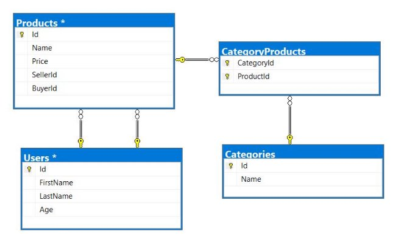


**Exercises: External Format Processing** 

**Products Shop Database** 

A products shop holds **users**, **products,** and **categories** for the products. Users can **sell** and **buy** products. 

- Users have an **id**, **first** **name** (optional), and **last** **name** (at least 3 characters) and **age** (optional). 
- Products have an **id**, **name** (at least 3 characters), **price**, **buyerId** (optional), and **sellerId** as IDs of users. 
- Categories have an **id** and **name** (from **3** to **15** characters) 

Using Entity Framework Code First create a database following the above description. 

- **Users** should have **many products sold** and **many products bought**.  
- **Products** should have **many categories** 
- **Categories** should have **many products** 
- **CategoryProducts** should **map products** and **categories** 

**Query 1. Import Data Query 2. Import Users** 

**NOTE**: You will need method public static string ImportUsers(ProductShopContext context, string inputJson) and public StartUp class.  

Import the users from the provided file **users.json**. 

Your method should return a string with the message $"Successfully imported {Users.Count}";

**Query 3. Import Products** 

**NOTE**: You will need method public static string ImportProducts(ProductShopContext context, string 

inputJson) and public StartUp class.  

Import the users from the provided file **products.json**. 

Your method should return a string with the message $"Successfully imported {Products.Count}";

**Query 4. Import Categories** 

**NOTE**: You will need method public static string ImportCategories(ProductShopContext context, string 

inputJson) and public StartUp class.  

Import the users from the provided file **categories.json**. Some of the names will be null, so you don’t have to add them to the database. Just skip the record and continue. 

Your method should return a string with the message $"Successfully imported {Categories.Count}"; **Query 5. Import Categories and Products** 

**NOTE**: You will need method public static string ImportCategoryProducts(ProductShopContext context, 

string inputJson) and public StartUp class.  

Import the users from the provided file **categories-products.json**.  

Your method should return a string with the message $"Successfully imported {CategoryProducts.Count}";

 **Query and Export Data** 

Write the below-described queries and **export** the returned data to the specified **format**. Make sure that Entity Framework generates only a **single query** for each task. 

Note that because of the random generation of the data output probably will be different. 

**Export Products in Range** 

**NOTE**: You will need method public static string GetProductsInRange(ProductShopContext context) and public StartUp class.  

Get all products in a specified **price range:**  500 to 1000 (inclusive). Order them by price (from lowest to highest). Select only the **product name**, **price,** and the **full name** **of the seller**. Export the result to JSON. 

|**products-in-range.json** |
| - |
|
[ 

`  `{ 

`    `"name": "TRAMADOL HYDROCHLORIDE",     "price": 516.48, 

`    `"seller": "Christine Gomez" 

`  `}, 

`  `{ 

`    `"name": "Allopurinol", 

`    `"price": 518.50, 

`    `"seller": "Kathy Gilbert" 
|
`  `}, 

`  `{ 

`    `"name": "Parsley", 

`    `"price": 519.06, 

`    `"seller": "Jacqueline Perez"   }, 

`  `... 

]

**Query 6. Export Successfully Sold Products** 

**NOTE**: You will need method public static string GetSoldProducts(ProductShopContext context) and public StartUp class.  

Get all users who have **at least 1 sold item** with a **buyer**. Order them by **the last name**, then by **the first name**. Select the person's **first** and **last name**. For each of the **sold products** (products with buyers), select the product's **name**, **price**, and the buyer's **first** and **last name**. 

|**users-sold-products.json** |
| - |
|
[ 

`  `{ 

`    `"firstName": "Gloria", 

`    `"lastName": "Alexander", 

`    `"soldProducts": [ 

`      `{ 

`        `"name": "Metoprolol Tartrate",         "price": 1405.74, 

`        `"buyerFirstName": "Bonnie", 

`        `"buyerLastName": "Fox" 

`      `} 

`    `] 

`  `}, 

`  `... 

]
|
**Export Categories by Products Count** 

**NOTE**: You will need method public static string GetCategoriesByProductsCount(ProductShopContext 

context) and public StartUp class.  

Get **all** **categories**. Order them in descending order by the category’s **products count**. For each category select its **name**, the **number of products**, the **average price of those products** (rounded to the second digit after the decimal separator), and the **total revenue** (total price sum and rounded to the second digit after the decimal separator) of those products (regardless if they have a buyer or not). 

**categories-by-products.json **

[ 

`  `{ 

`    `"category": "Garden", 

`    `"productsCount": 23, 

`    `"averagePrice": "800.15",     "totalRevenue": "18403.47",   }, 

`  `{ 

`    `"category": "Drugs", 

`    `"productsCount": 22, 

`    `"averagePrice": "882.20",     "totalRevenue": "19408.43"   }, 

`  `... 

]

**Query 7. Export Users and Products** 

**NOTE**: You will need method public static string GetUsersWithProducts(ProductShopContext context) and public StartUp class.  

Get all users who have **at least 1 sold product with a buyer**. Order them in descending order by the **number of sold products with a buyer**. Select only their **first** and **last name**, **age** and for each product - **name** and **price**. Ignore all null values. 

Export the results to **JSON**. Follow the format below to better understand how to structure your data.  

|**users-and-products.json** |
| - |
|
{ 

"usersCount":54, 

"users":  

[ 

`  `{ 

`    `"lastName": "Stewart", 

`    `"age": 39, 

`    `"soldProducts":  

`    `{ 

`      `"count": 9, 

`      `"products": 

`      `[ 

`      `{ 

`        `"name": "Finasteride",         "price": 1374.01 

`      `}, 
|
`      `{ 

`        `"name": "Glyburide", 

`        `"price": 95.1 

`      `}, 

`      `{ 

`        `"name": "GOONG SECRET CALMING BATH ",         "price":742.47 

`      `}, 

`      `{ 

`        `"name": "EMEND", 

`        `"price":1365.51 

`      `}, 

`      `{ 

`        `"name": "Allergena", 

`        `"price": 109.32 

`      `}, 

`      `... 

`      `] 

`    `} 

`  `}, 

`  `... 

] 

}