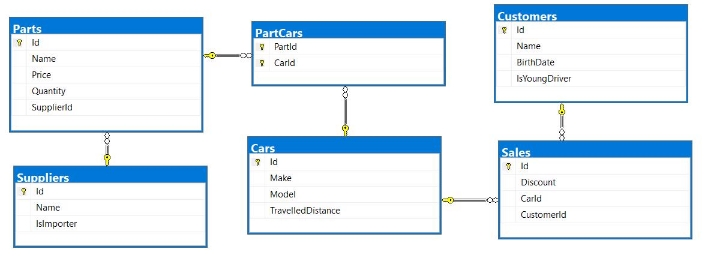


**Exercises: XML Processing** 

**Car Dealer Database ** **Setup Database** 

A car dealer needs information about cars, their parts, parts suppliers, customers, and sales.  

- **Cars** have **make, model**, traveled distance in kilometers 
- **Parts** have **a name**, **price** and **quantityPart** **supplier** have **name** and info whether he **uses imported parts** 
- **A customer** has a **name**, **date of birth**, and info whether he **is a young driver** 
- **Sale** has **a car**, **customer,** and **discount percentage** 

A **price of a car** is formed by **the total price of its parts**. 

- A **car** has **many parts** and **one part** can be placed **in many cars** 
- **One supplier** can supply **many parts** and each **part** can be delivered by **only one supplier** 
- In **one sale**, only **one car** can be sold 
- **Each sale** has **one customer** and **a customer** can buy **many cars** 

 **Import Data** 

Import data from the provided files (**suppliers.xml, parts.xml, cars.xml, customers.xml**). 

 **Import Suppliers** 

**NOTE**: You will need method public static string ImportSuppliers(CarDealerContext context, string inputXml) and public StartUp class.  

Import the suppliers from the provided file **suppliers.xml**.  

Your method should return a string with the message $"Successfully imported {suppliers.Count}";

 **Import Parts** 

**NOTE**: You will need method public static string ImportParts(CarDealerContext context, string 

inputXml) and public StartUp class.  

Import the parts from the provided file **parts.xml**. If the supplierId doesn’t exist, skip the record. 

Your method should return a string with the message $"Successfully imported {parts.Count}";

 **Import Cars** 

**NOTE**: You will need method public static string ImportCars(CarDealerContext context, string inputXml) and public StartUp class.  

Import the cars from the provided file **cars.xml**. Select unique car part ids. If the part id doesn’t exist, skip the part record. 

Your method should return a string with the message $"Successfully imported {cars.Count}";  **Import Customers** 

**NOTE**: You will need method public static string ImportCustomers(CarDealerContext context, string 

inputXml) and public StartUp class.  

Import the customers from the provided file **customers.xml**. 

Your method should return a string with the message $"Successfully imported {customers.Count}";  **Import Sales** 

**NOTE**: You will need method public static string ImportSales(CarDealerContext context, string 

inputXml) and public StartUp class.  

Import the sales from the provided file **sales.xml**. If car doesn’t exist, skip whole entity. 

Your method should return a string with the message $"Successfully imported {sales.Count}";

 **Query and Export Data** 

Write the below-described queries and **export** the returned data to the specified **format**. Make sure that Entity Framework generates only a **single query** for each task. 

 **Cars With Distance** 

**NOTE**: You will need method public static string GetCarsWithDistance(CarDealerContext context) and public StartUp class.  

Get all **cars** with a distance of more **than** 2,000,000. Order them by make, then by model alphabetically. Take top 10 records. 

**Return** the list of suppliers **to XML** in the format provided below. 

**cars.xml **

<?xml version="1.0" encoding="utf-16"?> 

<cars> 

`  `<car> 

`    `<make>BMW</make> 

`    `<model>1M Coupe</model> 

`    `<travelled-distance>39826890</travelled-distance>   </car> 

`  `<car> 

`    `<make>BMW</make> 

`    `<model>E67</model> 

`    `<travelled-distance>476830509</travelled-distance>   </car> 

`  `<car> 

`    `<make>BMW</make> 

`    `<model>E88</model> 

`    `<travelled-distance>27453411</travelled-distance>   </car>  

`  `... 

</cars>

 **Cars from make BMW** 

**NOTE**: You will need method public static string GetCarsFromMakeBmw(CarDealerContext context) and public StartUp class.  

Get all **cars** from make **BMW** and **order them by model alphabetically** and by **traveled distance descending**. **Return** the list of suppliers **to XML** in the format provided below. 

|**bmw-cars.xml** |
| - |
|
<cars> 

`  `<car id="7" model="1M Coupe" travelled-distance="39826890" />   <car id="16" model="E67" travelled-distance="476830509" /> 

`  `<car id="5" model="E88" travelled-distance="27453411" /> 

`  `... 

</cars>
|
 **Local Suppliers** 

**NOTE**: You will need method public static string GetLocalSuppliers(CarDealerContext context) and public StartUp class.  

Get all **suppliers** that **do not import parts from abroad**. Get their **id**, **name,** and **the number of parts they can offer to supply**.  

**Return** the list of suppliers **to XML** in the format provided below. 

|**local-suppliers.xml** |
| - |
|
<?xml version="1.0" encoding="utf-16"?> 

<suppliers> 

`  `<suplier id="2" name="VF Corporation" parts-count="3" />   <suplier id="5" name="Saks Inc" parts-count="2" /> 

`  `... 

</suppliers> 
|
 **Cars with Their List of Parts** 

**NOTE**: You will need method public static string GetCarsWithTheirListOfParts(CarDealerContext context) and public StartUp class.  

Get all **cars along with their list of parts**. For the **car** get only **make, model,** and **traveled distance** and for the **parts** get only **name** and **price** and sort all parts by price (descending). Sort all cars by traveled distance (**descending**) then by the model (**ascending**). Select top 5 records. 

**Return** the list of suppliers **to XML** in the format provided below. 

|**cars-and-parts.xml** |
| - |
|
<?xml version="1.0" encoding="utf-16"?> 

<cars> 

`  `<car make="Opel" model="Astra" travelled-distance="516628215"> 

`    `<parts> 

`      `<part name="Master cylinder" price="130.99" /> 

`      `<part name="Water tank" price="100.99" /> 

`      `<part name="Front Right Side Inner door handle" price="100.99" />     </parts> 

`  `</car> 

`  `... 

</cars>
|
 **Total Sales by Customer** 

**NOTE**: You will need method public static string GetTotalSalesByCustomer(CarDealerContext context) and public StartUp class.  

Get all **customers** that have bought **at least 1 car** and get their **names**, **bought cars** **count.** and **total spent money** on cars. **Order** the result list **by total spent money descending**. 

**Return** the list of suppliers **to XML** in the format provided below. 

|**customers-total-sales.xml** |
| - |
|
<?xml version="1.0" encoding="utf-16"?> 

<customers> 

`  `<customer full-name="Hai Everton" bought-cars="1" spent-money="2544.67" />   <customer full-name="Daniele Zarate" bought-cars="1" spent-money="2014.83" />   <customer full-name="Donneta Soliz" bought-cars="1" spent-money="1655.57" />  ... 

</customers>
|
 **Sales with Applied Discount** 

**NOTE**: You will need method public static string GetSalesWithAppliedDiscount(CarDealerContext context) and public StartUp class.  

Get all **sales** with information about the **car**, **customer,** and **price** of the sale **with and without discount**. **Return** the list of suppliers **to XML** in the format provided below. 

|**sales-discounts.xml** |
| - |
|
<?xml version="1.0" encoding="utf-16"?> <sales> 

- sale> 
|
`    `<car make="BMW" model="M5 F10" travelled-distance="435603343" />     <discount>30.00</discount> 

`    `<customer-name>Hipolito Lamoreaux</customer-name> 

`    `<price>707.97</price> 

`    `<price-with-discount>495.58</price-with-discount> 

`  `</sale> 

`  `... 

</sales>
