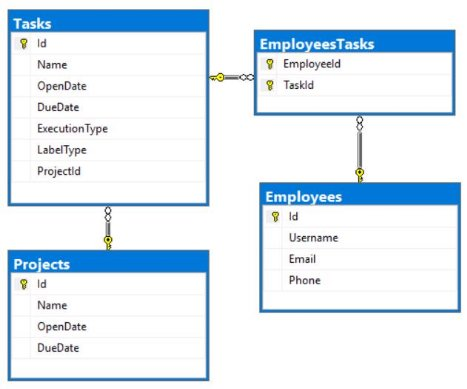

**Databases Advanced Exam - 4 April 2021** 

**AutoMapper** is **optional**. 

Your task is to create a **database application**, using **Entity Framework Core**, using the **Code First** approach. Design the **domain models** and **methods** for manipulating the data, as described below. 

**TeisterMask** 

1. **Project Skeleton Overview** 

You are given a **project skeleton**, which includes the following folders: 

- **Data** - contains the **TeisterMaskContext** class, **Models** folder which contains the **entity classes** and the **Configuration** class with **connection string** 
- **DataProcessor** - contains the **Serializer** and **Deserializer** classes, which are used for **importing** and **exporting** data 
- **Datasets** - contains the **.json** and **.xml** files for the import part 
- **ImportResults** - contains the **import** results you make in the **Deserializer** class 
- **ExportResults** - contains the **export** results you make in the **Serializer** class 
2. **Model Definition (50 pts)** 

The application needs to store the following data: **Employee** 

- **Id** - integer, Primary Key ****
- **Username** - text with length **[3, 40]**. Should contain only **lower** or **upper** case letters and/or **digits**. (**required**) 
- **Email** – text (**required**). Validate it! There is attribute for this job. 
- **Phone** - text. **Consists** **only of three groups** (**separated by '-'), the first two consist of three digits and the last one - of 4 digits.** (**required**)** 
- **EmployeesTasks -** collection of type **EmployeeTask** 

**Project** 

- **Id** - integer, **Primary Key** 
- **Name** - text with length **[2, 40]** (**required**) 
- **OpenDate** - date and time (**required**) 
- **DueDate** - date and time (**can be null**) 
- **Tasks** - collection of type **Task** 

**Task** 

- **Id** - integer, **Primary Key** 
- **Name** - text with length **[2, 40]** (**required**) 
- **OpenDate** - date and time (**required**) 
- **DueDate** - date and time (**required**) 
- **ExecutionType** - enumeration of type **ExecutionType**, with possible values (**ProductBacklog**, **SprintBacklog**, **InProgress**, **Finished**) (**required**) 
- **LabelType** - enumeration of type **LabelType**, with possible values (**Priority**, **CSharpAdvanced**, **JavaAdvanced**, **EntityFramework**, **Hibernate**) (**required**) 
- **ProjectId** - integer, **foreign key** (**required**) 
- **Project** - **Project**  
- **EmployeesTasks** - collection of type **EmployeeTask** 

**EmployeeTask** 

- **EmployeeId** - integer, **Primary Key**, **foreign key** (**required**) 
- **Employee** -  **Employee** 
- **TaskId** -** integer, **Primary Key**, **foreign key** (**required**) 
- **Task** - **Task** 
3. **Data Import (25pts)** 

For the functionality of the application, you need to create several methods that manipulate the database. The **project skeleton** already provides you with these methods, inside the **Deserializer** **class**. Usage of **Data Transfer Objects** and **AutoMapper** is **optional**. 

Use the provided **JSON** and **XML** files to populate the database with data. Import all the information from those files into the database. 

You are **not allowed** to modify the provided **JSON** and **XML** files. 

**If a record does not meet the requirements from the first section, print an error message: **

|**Error message** |
| - |
|Invalid Data! |
**XML Import** 

**Import Projects** 

Using the file **projects.xml**, import the data from the file into the database. Print information about each imported object in the format described below. 

**Constraints** 

- If there are **any validation errors** for the **project** entity (such as invalid **name** or **open date**), **do not** import any part of the entity and **append an error message** to the **method output**. 
- If there are **any validation errors** for the **task** entity (such as invalid **name**, **open** or **due date** are missing, **task open** **date** is before **project open date** or **task due date** is after **project due date**), **do not import it (only the task itself, not the whole project)** and **append an error message to the method output**. 

**NOTE**: Dates will be in format **dd/MM/yyyy**, do not forget to use **CultureInfo.InvariantCulture** 

|**Success message** |
| - |
|Successfully imported project - {**projectName**} with {**tasksCount**} tasks. |
**Example** 

|**projects.xml** |
| - |
|
<?xml version='1.0' encoding='UTF-8'?> <Projects> 

`  `<Project> 

`    `<Name>S</Name> 

`    `<OpenDate>25/01/2018</OpenDate> 

`    `<DueDate>16/08/2019</DueDate> 

`    `<Tasks> 

`      `<Task> 

`        `<Name>Australian</Name> 

`        `<OpenDate>19/08/2018</OpenDate>         <DueDate>13/07/2019</DueDate> 

`        `<ExecutionType>2</ExecutionType>         <LabelType>0</LabelType> 

`      `</Task> 

`      `<Task> 

`        `<Name>Upland Boneset</Name> 

`        `<OpenDate>24/10/2018</OpenDate>         <DueDate>11/06/2019</DueDate> 

`        `<ExecutionType>2</ExecutionType>         <LabelType>3</LabelType> 

`      `</Task> 

`    `</Tasks> 

`  `</Project> 

... 

</Projects>
|
|**Output** |
|
**Invalid data!** 

**Invalid data!** 

**Successfully imported project - America with 2 tasks. Successfully imported project - Hyster-Yale with 10 tasks. Invalid data!** 

**Invalid data!** 

**Invalid data!** 

**Invalid data!** 

**...** 
|
Upon **correct import logic**, you should have imported **42 projects** and **62 tasks**. 

**JSON Import** 

**Import Employees** 

Using the file **employees.json**, import the data from that file into the database. Print information about each imported object in the format described below. 

**Constraints** 

- If any validation errors occur (such as invalid **username**, **email** or **phone**), **do not** import any part of the entity and **append an error message** to the **method output**. 
- Take only the unique tasks. 
- If a **task** does **not exist** in the database, **append an error message** to the **method output** and **continue** with the next **task**. 

|**Success message** |
| - |
|Successfully imported employee - {**employeeUsername**} with {**employeeTasksCount**} tasks. |
**Example** 

|**employees.json** |
| - |
|
[ 

`  `{ 

`    `"Username": "jstanett0", 

`    `"Email": "kknapper0@opera.com",     "Phone": "819-699-1096", 

`    `"Tasks": [ 

`      `34, 

`      `32, 

`      `65, 

`      `30, 

`      `30, 

`      `45, 

`      `36,       67     ] 

`  `}, 

`  `... 

] 
|
|**Output** |
|
**Invalid data!** 

**Invalid data!** 

**Successfully imported employee - jstanett0 with 5 tasks. Invalid data!** 

**Invalid data!** 

**Invalid data!** 

**Invalid data!** 

**Successfully imported employee - mmcellen1 with 15 tasks. Invalid data!** 

**Invalid data!** 

**Successfully imported employee - cmartinho2 with 5 tasks. Successfully imported employee - mdilucia3 with 9 tasks. ...** 
|
Upon **correct import logic**, you should have imported **30** **employees** and **249 employee tasks**. 

4. **Data Export (25 pts)** 

Use the provided methods in the **Serializer** class.** Usage of **Data Transfer Objects** and **AutoMapper** is **optional**. 

**JSON Export** 

**Export Most Busiest Employees** 

Select the **top** 10 **employees** who have **at least one task** that **its open date** is **after or equal** to the **given date** with their **tasks** that meet the same requirement (to have their open date after or equal to the giver date). For each **employee**, export their **username** and their **tasks.** For each **task**, export its **name** and **open date** (**must** be in format "**d**"), **due date** (**must** be in format "**d**"), **label** and **execution** type**.** Order the **tasks** by **due date** (**descending**), then by **name** (**ascending**). Order the **employees** by **all** **tasks** (**meeting above condition**) **count** (**descending**), then by **username** (**ascending**). 

**NOTE**: Do not forget to use **CultureInfo.InvariantCulture.** You **may** need to **call** **.ToArray()** function **before the selection** in order to **detach entities from the database** and **avoid runtime errors** (**EF Core bug**).  

**Example **

|**Serializer.ExportMostBusiestEmployees(context, date)** |
| - |
|
[ 

`  `{ 

`    `"Username": "mmcellen1", 

`    `"Tasks": [ 

`      `{ 

`        `"TaskName": "Pointed Gourd", 

`        `"OpenDate": "10/08/2018", 

`        `"DueDate": "10/24/2019", 

`        `"LabelType": "Priority", 

`        `"ExecutionType": "ProductBacklog"       }, 

`      `{ 

`        `"TaskName": "Columbian", 

`        `"OpenDate": "10/24/2018", 

`        `"DueDate": "10/20/2019", 

`        `"LabelType": "Hibernate", 

`        `"ExecutionType": "InProgress" 

`      `}, 

`      `{ 

`        `"TaskName": "Cornflag", 

`        `"OpenDate": "09/27/2018", 

`        `"DueDate": "09/25/2019", 

`        `"LabelType": "CSharpAdvanced", 

`        `"ExecutionType": "SprintBacklog" 

`      `}, 

`      `{ 

`        `"TaskName": "Charleston Mousetail",         "OpenDate": "08/10/2018", 

`        `"DueDate": "07/07/2019", 

`        `"LabelType": "Hibernate", 

`        `"ExecutionType": "ProductBacklog" 

`      `}, 

`      `{ 

`        `"TaskName": "California Dwarf-flax",         "OpenDate": "10/01/2018", 

`        `"DueDate": "06/01/2019", 

`        `"LabelType": "Hibernate", 

`        `"ExecutionType": "Finished" 

`      `}, 

`      `{ 

`        `"TaskName": "Digitgrass", 
|
`        `"OpenDate": "06/02/2018", 

`        `"DueDate": "05/18/2019", 

`        `"LabelType": "EntityFramework", 

`        `"ExecutionType": "ProductBacklog" 

`      `}, 

`      `{ 

`        `"TaskName": "Hairy Mountain Mahogany",         "OpenDate": "09/21/2018", 

`        `"DueDate": "04/29/2019", 

`        `"LabelType": "Priority", 

`        `"ExecutionType": "SprintBacklog" 

`      `}, 

`      `{ 

`        `"TaskName": "White", 

`        `"OpenDate": "10/04/2018", 

`        `"DueDate": "04/21/2019", 

`        `"LabelType": "Hibernate", 

`        `"ExecutionType": "SprintBacklog" 

`      `}, 

`      `{ 

`        `"TaskName": "Bryum", 

`        `"OpenDate": "11/02/2018", 

`        `"DueDate": "01/19/2019", 

`        `"LabelType": "EntityFramework", 

`        `"ExecutionType": "ProductBacklog" 

`      `}, 

`      `{ 

`        `"TaskName": "American Star-thistle",         "OpenDate": "09/21/2018", 

`        `"DueDate": "11/29/2018", 

`        `"LabelType": "CSharpAdvanced", 

`        `"ExecutionType": "ProductBacklog" 

`      `}, 

`      `{ 

`        `"TaskName": "Wirestem Buckwheat", 

`        `"OpenDate": "04/13/2018", 

`        `"DueDate": "11/22/2018", 

`        `"LabelType": "Hibernate", 

`        `"ExecutionType": "InProgress" 

`      `}, 

`      `{ 

`        `"TaskName": "Spreading Sandwort", 

`        `"OpenDate": "02/19/2018", 

`        `"DueDate": "11/20/2018", 

`        `"LabelType": "Hibernate", 

`        `"ExecutionType": "InProgress" 

`      `}, 

`      `{ 

`        `"TaskName": "Cypress Panicgrass", 

`        `"OpenDate": "10/19/2018", 

`        `"DueDate": "11/17/2018", 

`        `"LabelType": "EntityFramework", 

`        `"ExecutionType": "InProgress" 

`      `}, 

`      `{ 

`        `"TaskName": "Calophyllum", 

`        `"OpenDate": "10/09/2018", 

`        `"DueDate": "11/15/2018", 

`        `"LabelType": "CSharpAdvanced", 

`        `"ExecutionType": "InProgress" 

`      `} 

`    `] 

`  `}, 

... 

]

**XML Export** 

**Export Projects with Their Tasks** 

Export all **projects** that have at least **one** task. For each **project**, export its **name**, **tasks count**, and if it **has end (due) date** which is represented like "**Yes**" and "**No**"**.** For each **task**, export its **name** and **label type.** Order the **tasks** by **name** (**ascending**). Order the **projects** by **tasks count** (**descending**), then by **name** (**ascending**). 

**NOTE**: You **may** need to **call** **.ToArray()** function **before the selection** in order to **detach entities from the database** and **avoid runtime errors** (**EF Core bug**).  

**Example **

|**Serializer.ExportProjectWithTheirTasks(context)** |
| - |
|
<?xml version="1.0" encoding="utf-16"?> <Projects> 

`  `<Project TasksCount="10"> 

`    `<ProjectName>Hyster-Yale</ProjectName>     <HasEndDate>No</HasEndDate> 

`    `<Tasks> 

`      `<Task> 

`        `<Name>Broadleaf</Name> 

`        `<Label>JavaAdvanced</Label> 

`      `</Task> 

`      `<Task> 

`        `<Name>Bryum</Name> 

`        `<Label>EntityFramework</Label> 

`      `</Task> 

`      `<Task> 

`        `<Name>Cornflag</Name> 

`        `<Label>CSharpAdvanced</Label> 

`      `</Task> 

`      `<Task> 

`        `<Name>Crandall</Name> 

`        `<Label>Priority</Label> 

`      `</Task> 

`      `<Task> 

`        `<Name>Debeque</Name> 

`        `<Label>JavaAdvanced</Label> 

`      `</Task> 

`      `<Task> 

`        `<Name>Guadalupe</Name> 

`        `<Label>JavaAdvanced</Label> 

`      `</Task> 

`      `<Task> 

`        `<Name>Guadeloupe</Name> 

`        `<Label>JavaAdvanced</Label> 

`      `</Task> 

`      `<Task> 

`        `<Name>Longbract Pohlia Moss</Name>         <Label>EntityFramework</Label> 

`      `</Task> 

`      `<Task> 

`        `<Name>Meyen's Sedge</Name> 

`        `<Label>EntityFramework</Label> 

`      `</Task> 

`      `<Task> 

`        `<Name>Pacific</Name> 

`        `<Label>Priority</Label> 

`      `</Task>     </Tasks> 

`  `</Project> ... 

</Projects>
|

