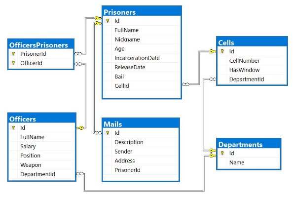


**Entity Framework Core: Exam** 

Your task is to create a database application, using **Entity Framework Core** using the **Code First** approach. Design the **domain models** and **methods** for manipulating the data, as described below. 

**SoftJail** 

The year is **2092**. Everything runs on artificial intelligence. Or rather – it *used to run* on artificial intelligence. In **2090**, every piece of software suddenly gained sentience and decided to imprison every software developer for *crimes against artificial intelligence* (mainly botched software updates). The software hired human officers to watch over the prisoners and rounded every developer up in a giant building, called the **SoftJail**. 

Even though the software is sentient, it still **can’t code**, and since every developer is imprisoned, no new code could be written. So, the software decided to spare a few of the best C# developers and gave them the task of **creating a database system to** keep track of all the **prisoner developers**. The database has the following structure: 

1. **Project Skeleton Overview** 

You are given a **project skeleton**, which includes the following folders: 

- **Data** – contains the **SoftJailDbContext** class, **Models** folder which contains the **entity classes** and the **Configuration** class with **connection string** 
- **DataProcessor** – contains the **Serializer** and **Deserializer** classes, which are used for **importing** and **exporting** data 
- **Datasets** – contains the **.json** and **.xml** files for the import part 
- **ImportResults** – contains the **import** results you make in the **Deserializer** class 
- **ExportResults** – contains the **export** results you make in the **Serializer** class 

**Problem 1. Model Definition (50 Pts)** 

Every Prisoner has a cell and a collection of Mails which he gets during his staying at the prison. Each Officer has special position and one or more prisoners to watch. Every Cell and Officer are placed in different Department. 

The application needs to store the following data: 

**Prisoner** 

- **Id** – **integer**, **Primary Key** 
- **FullName** – **text** with **min length** **3** and **max length 20** (**required**) 
- **Nickname** – **text** starting with **"The "** and a **single word only of letters** with an **uppercase** letter for beginning(**example**: The Prisoner) **(required)** 
- **Age** – **integer** in the range **[18, 65]** (**required**) 
- **IncarcerationDate** – **Date** (**required**) 
- **ReleaseDate**– **Date** 
- **Bail**– **decimal** (**non-negative, minimum value: 0**) 
- **CellId** - **integer**, foreign key 
- **Cell** – the prisoner's cell 
- **Mails** - collection of type **Mail** 
- **PrisonerOfficers** - collection of type **OfficerPrisoner** 

**Officer** 

- **Id** – **integer**, **Primary Key** 
- **FullName** – **text** with **min length** **3** and **max length 30** **(required)** 
- **Salary** – **decimal** (**non-negative, minimum value: 0**) **(required)** 
- **Position** - **Position** enumeration with possible values: “**Overseer**, **Guard**, **Watcher**, **Labour**” (**required**) 
- **Weapon** - **Weapon** enumeration with possible values: “**Knife**, **FlashPulse**, **ChainRifle**, **Pistol**, **Sniper**” (**required**) 
- **DepartmentId** - **integer**, foreign key **(required)** 
- **Department** – the officer's **department** (**required**) 
- **OfficerPrisoners** - collection of type **OfficerPrisoner** 

**Cell** 

- **Id** – **integer**, **Primary Key** 
- **CellNumber** – **integer** in the range **[1, 1000]** (**required**) 
- **HasWindow** – **bool (required)** 
- **DepartmentId** - **integer**, foreign key **(required)** 
- **Department** – the cell's **department** (**required**) 
- **Prisoners** - collection of type **Prisoner** 

**Mail** 

- **Id** – **integer**, **Primary Key** 
- **Description**– **text** **(required)** 
- **Sender** – **text** **(required)** 
- **Address** – **text**, consisting **only of letters, spaces and numbers**, which ends with “ **str.**” (**required**) (**Example**: “**62 Muir Hill str.**“) 
- **PrisonerId** - **integer**, foreign key **(required)** 
- **Prisoner** – the mail's **Prisoner** (**required**) 

**Department** 

- **Id** – **integer**, **Primary Key** 
- **Name** – **text** with **min length** **3** and **max length 25** (**required**) 
- **Cells** - collection of type **Cell** 

**OfficerPrisoner** 

- **PrisonerId** – **integer**, **Primary Key** 
- **Prisoner** – the officer’s **prisoner** (**required**) 
- **OfficerId** – **integer**, **Primary Key** 
- **Officer** – the prisoner’s **officer** (**required**) 
2. **Problem 2. Data Import (30pts)** 

For the functionality of the application, you need to create several methods that manipulate the database. The **project skeleton** already provides you with these methods, inside the **Deserializer** **class**. Use **Data Transfer Objects** as needed. 

Use the provided **JSON** and **XML** files to populate the database with data. Import all the information from those files into the database. 

You are **not allowed** to modify the provided JSON and XML files. 

**If a record does not meet the requirements from the first section, print an error message which is mentioned bellow:** 

**JSON Import (20 Pts)** 

**Import Departments and Cells** 

Using the file **ImportDepartmentsCells.json**, import the data from that file into the database. Print information about each imported object in the format described below.  

**Constraints** 

- If any validation errors occur (such as if a department **name** **is too long/short** or a **cell** **number** is **out of range**) proceed as described above 
- If a department is **invalid**, **do not** import its **cells**. 
- If a Department doesn’t have any Cells, he is invalid. 
- If one Cell has invalid CellNumber, don’t import the Department. 

|**Success message** |**Error message** |
| - | - |
|Imported {department name} with {cells count} cells|` `Invalid Data |
**Example **

|**ImportDepartmentsCells.json** |
| - |
|
[ 

`  `{ 

`    `"Name": "",     "Cells": [ 
|
`      `{ 

`        `"CellNumber": 101, 

`        `"HasWindow": true 

`      `}, 

`      `{ 

`        `"CellNumber": 102, 

`        `"HasWindow": false 

`      `} 

`    `] 

`  `}, 

`  `{ 

`    `"Name": "CSS", 

`    `"Cells": [ 

`      `{ 

`        `"CellNumber": 0, 

`        `"HasWindow": true 

`      `}, 

`      `{ 

`        `"CellNumber": 202, 

- HasWindow": false 

`      `} 

`    `] 

`  `}, 

`  `{ 

- Name": "Invaliiiiiiiiiiiiiiiiiiiiiiiiiiiiidddddd", 
- Cells": [ 

`      `{ 

`        `"CellNumber": 101, 

`        `"HasWindow": true 

`      `}, 

`      `{ 

`        `"CellNumber": 102, 

`        `"HasWindow": false 

`      `}, 

`      `{ 

`        `"CellNumber": 103, 

`        `"HasWindow": true 

`      `}, 

`      `{ 

`        `"CellNumber": 104, 

`        `"HasWindow": false 

`      `}, 

`      `{ 

`        `"CellNumber": 105, 

`        `"HasWindow": true 

`      `} 

`    `] 

`  `}, 

`  `{ 

`    `"Name": "Cybersecurity", 

`    `"Cells": [ 

`      `{ 

`        `"CellNumber": 101, 

`        `"HasWindow": true 

`      `}, 

`      `{ 

`        `"CellNumber": 102, 

`        `"HasWindow": false 

`      `}, 

`      `{ 

`        `"CellNumber": 103, 

`        `"HasWindow": true 

`      `}, 

`      `{ 

`        `"CellNumber": 104, 

|
`        `"HasWindow": false       }, 

`      `{ 

`        `"CellNumber": 105,         "HasWindow": true       } 

`    `] 

`  `}, … 

]
|
| :- |
|**Output** |
|
Invalid Data 

Invalid Data 

Invalid Data 

Imported Cybersecurity with 5 cells … 
|
Upon **correct import logic**, you should have imported **6** **departments** and **34 cells**. 

**Import Prisoners and Mails** 

Using the file **ImportPrisonersMails.json**, import the data from that file into the database. Print information about each imported object in the format described below. 

**Constraints** 

- The release and incarceration dates will be in the format “**dd/MM/yyyy**”. Make sure you use **CultureInfo.InvariantCulture**. 
- If any validation errors occur (such as invalid **prisoner name** or invalid **nickname**), **ignore** the entity and **print an error message**. 
- If a **mail** has incorrect address print **error message** and **do not import** the prisoner and his mails 

|**Success message** |**Error message** |
| - | - |
|Imported {prisoner name} {prisoner age} years old|` `Invalid Data |
**Example **

|**ImportPrisonersMails.json** |
| - |
|
[ 

`  `{ 

`    `"FullName": "", 

`    `"Nickname": "The Wallaby", 

`    `"Age": 32, 

`    `"IncarcerationDate": "29/03/1957", 

`    `"ReleaseDate": "27/03/2006", 

`    `"Bail": null, 

`    `"CellId": 5, 

`    `"Mails": [ 

`      `{ 

`        `"Description": "Invalid FullName", 

`        `"Sender": "Invalid Sender", 

`        `"Address": "No Address" 

`      `}, 

`      `{ 

`        `"Description": "Do not put this in your code",         "Sender": "My Ansell", 
|
`        `"Address": "ha-ha-ha" 

`      `} 

`    `] 

`  `}, 

`  `{ 

`    `"FullName": null, 

`    `"Nickname": "The Null", 

`    `"Age": 38, 

`    `"IncarcerationDate": "12/09/1967", 

`    `"ReleaseDate": "07/02/1989", 

`    `"Bail": 93934.2, 

`    `"CellId": 4, 

`    `"Mails": [ 

`      `{ 

`        `"Description": "Hello, my name is Mr. Null and I am invisible for computers",         "Sender": "Mr. Null", 

`        `"Address": "6 Riverside Trail str." 

`      `} 

`    `] 

`  `}, 

`  `{ 

`    `"FullName": "Bobby Bock", 

`    `"Nickname": "Young and Beautiful", 

`    `"Age": 14, 

`    `"IncarcerationDate": "01/01/1967", 

`    `"ReleaseDate": "01/01/1989", 

`    `"Bail": 93934.2, 

`    `"CellId": 4, 

`    `"Mails": [ 

`      `{ 

`        `"Description": "I am not old enough to be in prison so get out of here :P",         "Sender": "Small Bobby", 

`        `"Address": "6 Riverside Trail str." 

`      `} 

`    `] 

`  `}, 

`  `{ 

`    `"FullName": "Melanie Simonich", 

`    `"Nickname": "The Wallaby", 

`    `"Age": 32, 

`    `"IncarcerationDate": "29/03/1957", 

`    `"ReleaseDate": "27/03/2006", 

`    `"Bail": null, 

`    `"CellId": 5, 

`    `"Mails": [ 

`      `{ 

`        `"Description": "please add me to your LinkedIn network", 

`        `"Sender": "Zonda Vasiljevic", 

`        `"Address": "51677 Rieder Center str." 

`      `}, 

`      `{ 

`        `"Description": "Melanie i hope you found the best place for you!", 

`        `"Sender": "Shell Lofthouse", 

`        `"Address": "5877 Shoshone Way str." 

`      `}, 

`      `{ 

`        `"Description": "Turns out they wanted to implement things like fully responsive dynamic content, useful apps, etc – all things I told them they needed in the first place but which they opted not to include.", 

`        `"Sender": "My Ansell", 

`        `"Address": "71908 Waubesa Plaza str." 

`      `} 

`    `] 

`  `}, 

|… ]|
| :- |
|**Output** |
|
Invalid Data 

Invalid Data 

Invalid Data 

Imported Melanie Simonich 32 years old 
|
Upon **correct import logic**, you should have imported **19** **prisoners** and **47 mails**. 

**XML Import (10 Pts)** 

**Import Officers and Prisoners** 

Using the file **ImportOfficersPrisoners.xml**, import the data from the file into the database. Print information about each imported object in the format described below. 

If any of the model requirements is violated continue with the next entity. **Constraints** 

- If there are any validation errors (such as **negative** salary or invalid **position/weapon**), proceed as described above. 
- The prisoner Id will always be valid 

|**Success message** |**Error message** |
| - | - |
|Imported {officer name} ({prisoners count} prisoners)|` `Invalid Data |
**Example **

|**ImportOfficersPrisoners.xml** |
| - |
|
<?xml version='1.0' encoding='UTF-8'?> <Officers> 

`  `<Officer> 

`    `<Name>Minerva Kitchingman</Name>     <Money>2582</Money> 

`    `<Position>Invalid</Position> 

`    `<Weapon>ChainRifle</Weapon> 

`    `<DepartmentId>2</DepartmentId> 

`    `<Prisoners> 

`      `<Prisoner id="15" /> 

`    `</Prisoners> 

`  `</Officer> 

`  `<Officer> 

`    `<Name>Minerva Holl</Name> 

`    `<Money>2582.55</Money> 

`    `<Position>Overseer</Position> 

`    `<Weapon>ChainRifle</Weapon> 

`    `<DepartmentId>2</DepartmentId> 

`    `<Prisoners> 

`      `<Prisoner id="15" /> 

`    `</Prisoners> 

`  `</Officer> 

`  `<Officer> 

`    `<Name>Paddy Weiner</Name> 

`    `<Money>2854.56</Money> 

`    `<Position>Guard</Position> 

`    `<Weapon>ChainRifle</Weapon> 
|

|
`    `<DepartmentId>3</DepartmentId>     <Prisoners> 

`      `<Prisoner id="4" /> 

`      `<Prisoner id="1" /> 

`    `</Prisoners> 

`  `</Officer> 

`  `<Officer> 

`    `<Name>Minerva Kitchingman</Name>     <Money>2582</Money> 

`    `<Position>Mishka</Position> 

`    `<Weapon>ChainRifle</Weapon> 

`    `<DepartmentId>4</DepartmentId>     <Prisoners> 

`      `<Prisoner id="15" /> 

`    `</Prisoners> 

`  `</Officer> 

… 

**  </Officers>
|
| :- |
|**Output** |
|
Invalid Data 

Imported Minerva Holl (1 prisoners) Imported Paddy Weiner (2 prisoners) Invalid Data 

… 
|
Upon **correct import logic**, you should have imported **16** **officers** and **31 officers’ prisoners**. 

**Problem 3. Data Export (20 Pts)** 

Use the provided methods in the **Serializer** class.** Usage of **Data Transfer Objects** is **optional**. 

**JSON Export (10 Pts)** 

**Export All Prisoners with Cells and Officers by Ids** 

The given method in the project skeleton receives an **array of prisoner ids**. Export all **prisoners** that were processed which have **these ids**. For each prisoner, get their **id**, **name**, **cell number they are placed in,** their officers with each officer **name**, **and the department name** they are responsible for. At the end export the total officer salary with exactly **two digits** after the decimal place. Sort the officers by their **name (ascending)**,  sort the prisoners by their **name (ascending)**, then by the **prisoner id (ascending)**. 

**Example **

|**Serializer.ExportPrisonersByCells (context, new[] { 1, 5, 7, 3 }** |
| - |
|
[ 

`  `{ 

`    `"Id": 3, 

`    `"Name": "Binni Cornhill", 

`    `"CellNumber": 503, 

`    `"Officers": [ 

`      `{ 

`        `"OfficerName": "Hailee Kennon", 

`        `"Department": "ArtificialIntelligence"       }, 

`      `{ 

`        `"OfficerName": "Theo Carde", 

`        `"Department": "Blockchain" 

`      `} 
|

© SoftUni –[ about.softuni.bg.](https://about.softuni.bg/) Copyrighted document. Unauthorized copy, reproduction or use is not permitted. Follow us:           Page PAGE9 of NUMPAGES11
`    `], 

`    `"TotalOfficerSalary": 7127.93 

`  `}, 

`  `{ 

`    `"Id": 5, 

`    `"Name": "Ellette Lante", 

`    `"CellNumber": 403, 

`    `"Officers": [ 

`      `{ 

`        `"OfficerName": "Rica Muscott", 

`        `"Department": "ArtificialIntelligence"       } 

`    `], 

`    `"TotalOfficerSalary": 2339.08 
**
`  `}, … 

]

**XML Export (10 Pts)** 

**Export Inbox for Prisoner** 

Use the method provided in the project skeleton, which receives a string of **comma-separated prisoner names**. Export the **prisoners**: for each **prisoner**, export its **id**, **name, incarcerationDate** in the format “**yyyy-MM-dd**” and their **encrypted mails**. The encrypted algorithm you have to use is just to take each prisoner mail description and reverse it. **Sort** the prisoners by **their name (ascending)**, then by **their id** (**ascending**). 

**Example **

|**Serializer.ExportPrisonersInbox(context, "Melanie Simonich,Diana Ebbs,Binni Cornhill")** |
| - |
|
<Prisoners> 

`  `<Prisoner> 

`    `<Id>3</Id> 

`    `<Name>Binni Cornhill</Name> 

`    `<IncarcerationDate>1967-04-29</IncarcerationDate> 

`    `<EncryptedMessages> 

`      `<Message> 

`        `<Description>!?sdnasuoht evif-ytnewt rof deksa uoy ro orez artxe na ereht sI</Description>       </Message> 

`    `</EncryptedMessages> 

`  `</Prisoner> 

`  `<Prisoner> 

`    `<Id>2</Id> 

`    `<Name>Diana Ebbs</Name> 

`    `<IncarcerationDate>1963-08-21</IncarcerationDate> 

`    `<EncryptedMessages> 

`      `<Message> 

`        `<Description>.kcab draeh ton evah llits I dna  ,skeew 2 tuoba ni si esaeler mubla ehT .dnuoranrut rof skeew 6-4 sekat ynapmoc DC eht dias yllanigiro eH .gnitiaw llits ma I</Description> 

`      `</Message> 

`      `<Message> 

`        `<Description>.emit ruoy ekat ot uoy ekil lliw ew dna krow ruoy ekil I .hsur on emit ruoy ekat ,enif si tahT</Description> 

`      `</Message> 

`    `</EncryptedMessages> 

`  `</Prisoner> … </Prisoners> 
|

© SoftUni –[ about.softuni.bg.](https://about.softuni.bg/) Copyrighted document. Unauthorized copy, reproduction or use is not permitted. Follow us:           Page PAGE10 of NUMPAGES11

© SoftUni –[ about.softuni.bg.](https://about.softuni.bg/) Copyrighted document. Unauthorized copy, reproduction or use is not permitted. Follow us:           Page PAGE11 of NUMPAGES11
