
**Exercise: DOM Events** 

1. **Sections** 

You will receive an **array** of strings. For each string, create a **div** with a **paragraph** with the **string** in it. Each paragraph is initially **hidden (display:none)**. Add a **click** **event** **listener** to **each div** that **displays** the **hidden** paragraph. Finally, you should **append** all divs to the element with an **id** "**content**". 

**Example** 

 à 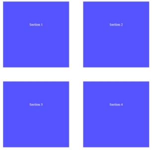

2. **Time Converter** 

Create a program that **converts** different time units. Your task is to add a **click** event listener to **all** [**CONVERT**] **buttons**. When a button is **clicked**, read the **corresponding** input field, **convert** the value to the **three other** time units and **display** it in the input fields. 

**Example **

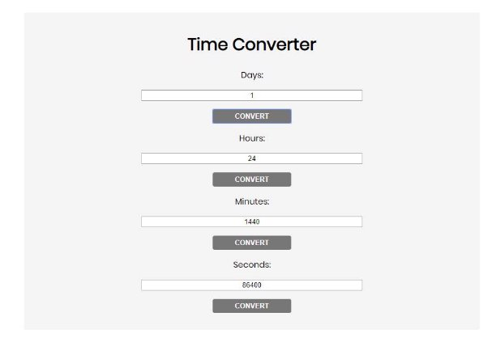

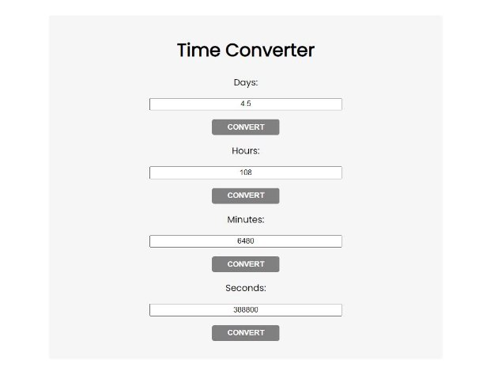One day is equal to 24 hours/1440 minutes/86400 seconds. Whichever button we **click,** the input fields should **change** depending on the added value on the left. (For example, if we write 48 hours and click convert the days, the field value should change to 2).

3. **Locked Profile** 

In this problem, you should **create a JS functonality** which **shows** and **hides** the additional information about users. 

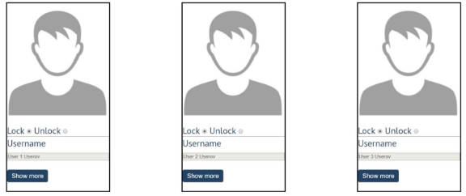

When one of the [**Show more**] **buttons** is clicked, the **hiden information** inside the div should be shown, only if **the profile is not locked**! If the current profile is **locked,** nothing should happen. 

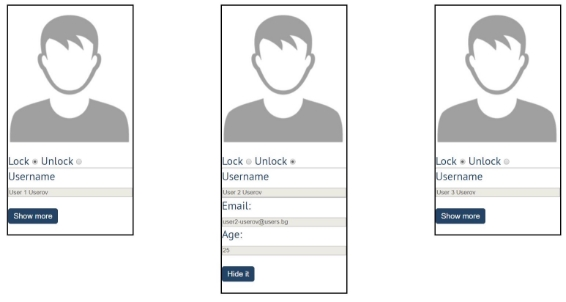

If the **hidden information is displayed** and we **lock** **the profile again**, the [**Hide it**] button should **not be working**! Otherwise, when the profile is **unlocked** and we click on the **[Hide it]** button, the new fields must hide again. 

4. **Fill Dropdown** 

Your task is to take values from **input** fields with **ids "newItemText"** and **"newItemValue"**.** Then you should create and append an option to the select with id "menu". 

**Example** 

**Hints** 

- Your function should take the values of **newItemText** and **newItemValue**. After that you should create a new **option** element and set its **textContent** and its **value** to the newly taken ones.  
- Once you have done all of that, you should **append** the newly created **option** as a **child** to the **select** item with id **"menu".** 
- Finally, you should **clear** the value of the two **input** fields. 
5. **Encode and Decode Messages** 

In this problem, you should **create a JS functonality** which **encodes and decodes some messages which travel to the network.** 

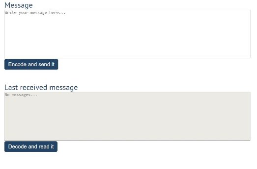

This program should contain **two functionalities**. 

The first one is to **encode the given message** and **send it** to the **receiver**.  The second one is to **decode the received message** and **read it (display it)**. 

When the [**Encode and send it**] **button** is clicked, you should get the given message from the first textarea. When you get the current message, you should encode it as follows: 

- **Change** the **ASCII CODE** on **every single character** in that message when you **add 1** to the current **ASCII NUMBER**, that represent the current character in that message 
- **Clear** the **sender** **textarea** and **added** the encoded message to the **receiver textarea** 

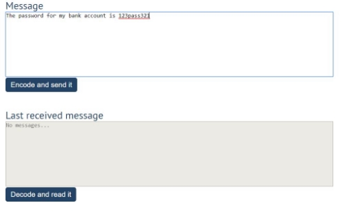

After clicking [**Encode and send it**] **button** the result should be: 

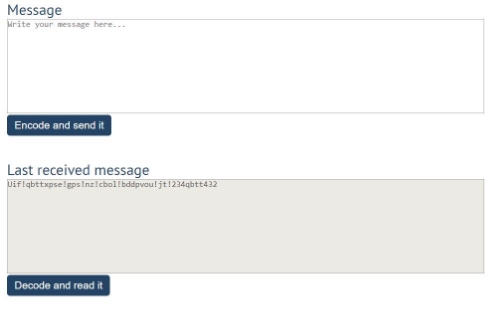

After that, when the [**Decode and read it**] **button** is clicked. You need to get the **encoded message** from **the receiver textarea** and do the **opposite logic** from encoding: 

- **Subtract 1** from the current **ASCII NUMBER**, that represents the current character in that message 
- Replace the **encoded message** with the already **decoded message** in the receiver textrea, to make it readable 

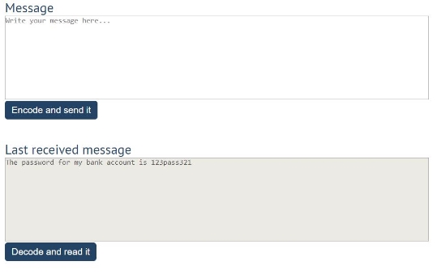

6. **Furniture** 

You will be given some furniture as an **array of objects**. Each object will have a **name**, a **price** and a **decoration factor**.  

When the **"Generate" button is clicked**, add a **new row to the table** for each piece of furniture with **image, name, price** and **decoration factor** (code example below).  

When the **"Buy"** button is clicked, get all **checkboxes that are marked** and show in the **result textbox** the **names** of the piece of furniture that **were checked**, separated by a **comma** and **single** **space** (**", "**) in the following format: **"Bought furniture: {furniture1}, {furniture2}…"**. 

On the next line, print the total price in format: **"Total price: {totalPrice}"** (formatted to the second decimal point). Finally, print the average decoration factor in the format: **"Average decoration factor: {decFactor}"** 

**Input Example** 

**[{"name": "Sofa", "img": "https://res.cloudinary.com/maisonsdumonde/image/upload/q\_auto,f\_auto/w\_200/img/ grey-3-seater-sofa-bed-200-13-0-175521\_9.jpg", "price": 150, "decFactor": 1.2}] **

**Examples** 

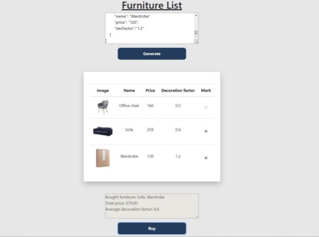

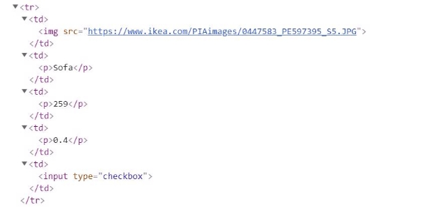

7. **Distance Converter \*** 

Your task is to convert from **one** distance unit to **another** by adding a **click** event listener to a button. When it is clicked, **read** the value from the input field and **get** the **selected** option from the **input** and **output** units drop downs. Then **calculate** and **display** the converted value in the **disabled** output field.

**Example** 

**Hints** 

- Multiply the incoming distance by the following conversion rates to convert to meter 
- Divide to convert from meters to the required output unit 
- To see which option is selected, read the properties of its parent: **value** gives you the value of the selected option (as displayed in the HTML), **selectedIndex** gives you the 0-based index of the selected option. For example, if miles are selected, **inputUnits.value** is "**mi**", **inputUnits.selectedIndex** is **4**. Option text is irrelevant 
- Use the following table information to do that: 

|**1 km** |**1000 m** |
| - | - |
|**1 m** |**1 m** |
|**1 cm** |0.1 **m** |
|**1 mm** |0.1 **m** |
|**1 mi** |**1609.34 m** |
|**1 yrd** |**0.9144 m** |
|**1 ft** |**0.3048 m** |
|**1 in** |**0.0254 m** |
8. **Sudomu \*** 

Write a function that implements **SUDOMU** (**Sudoku inside the DOM**). 

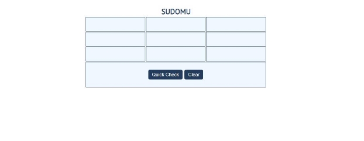

The rules are simple and they are **the same** as the **typical sudoku game** (for more information,  click[ here)](https://sudoku.com/how-to-play/sudoku-rules-for-complete%20beginners/) 

If the table is filled with the **right numbers**, and the "**Quick Check**" button is **clicked**, the expected result should be: 

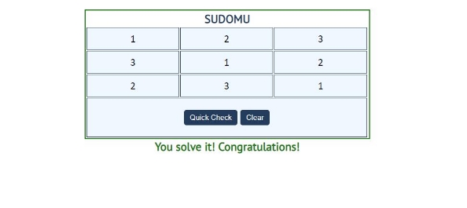

The table borer should be changed to: "**2px solid green".** The **text content** of the **paragraph** inside the **div** with an **id** "**check**" must be "**You solve it! Congratulations!**" 

The text color of that paragraph must be **green.**  

Otherwise, when the filled table **does not solve** **the sudomu,** the result should be: 

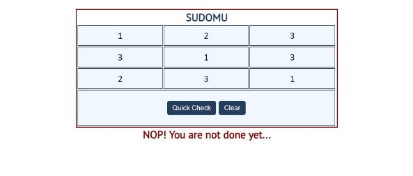

The table border should be changed to: "**2px solid red**".  

The **text content** of the **paragraph** inside the **div** with an **id** "**check**" must be: "**NOP! You are not done yet...**"  

The text color of that** paragraph must be **red!** 

The** "**Clear**"** button **clears the whole** **SUDOMU (removes all numbers)** and the **paragraph which contains the messages. It also removes the table border.**  

9. **JavaScript Quizz \*** 

Write a function that has the functionality of a quiz.  

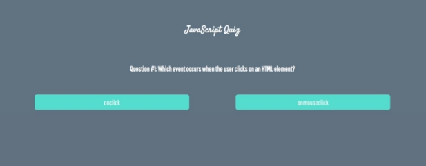

There are three **sections** that contain **one question** **and 2 possible answers.  The right answer is only one!**  

When one of the **list elements is clicked,** the next section **must appear (if any…)**. 

After all three questions have been answered, the **results ul** must **appear,** (Use **'none'** and **'block**' to hide and show the question sections), and the results must be added in the h1. 

If all questions are answered correctly, you should prin the following message:  

"**You are recognized as top JavaScript fan!**" 

Otherwise, just print "**You have {rightAnswers} right answers**". 

The right answers are (**onclick, JSON.stringify() and A programming API for HTML and XML** 

**documents**). 

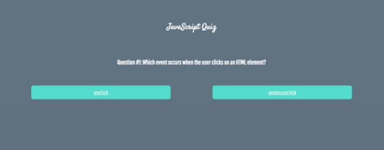

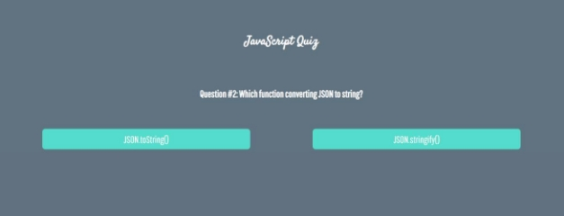

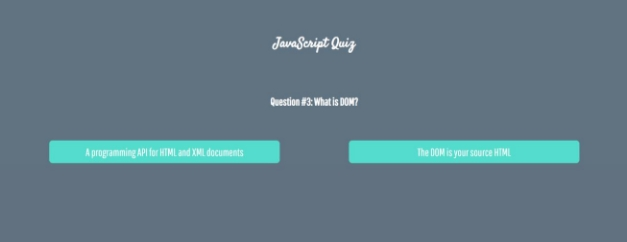

