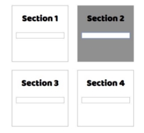
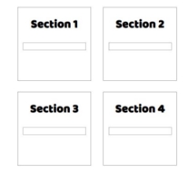
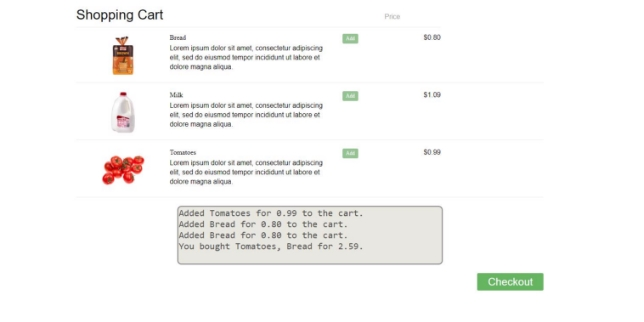


**Lab: DOM Events** 

1. **List of Items** 

Write a function that **read** the text inside an input field and **appends** the specified text to a list inside an HTML page. **Examples** 

à  à  

2. **Add / Delete** 

Extend the previous problem to display a **[Delete] link** after each list item. **Clicking** it, should **delete** the item with no confirmation. You have to add **href="#"** to the link element.** 

**Examples** 

à  

3. **Delete from Table** 

Write a program that **takes** an **e-mail** from an **input field** and **deletes** the matching row from a table. The 

textContent in the element with id="result" must be set to "Deleted". If no entry is found, an **error** should be displayed in a **
** with ID "**results**". The error should be "**Not found**." Submit **only** the **deleteByEmail()** function in judge.  

**Input/Output** 

There will be no input/output, your program should instead **modify** the DOM of the given HTML document. 

**Examples** 

4. **Mouse Gradient** 

Write a program that **detects** and **displays** how far along a gradient the user has **moved** their **mouse**. The result should be **rounded down** and displayed as a **percentage** inside the **
** with ID "**result**".  

Submit **only** the **attachGradientEvents()** function in judge.  

**Input/Output** 

There will be no input/output, your program should instead **modify** the DOM of the given HTML document. 

**Examples** 

5. **Highlight Active** 

Write a **function** that **highlights** the **currently active** section of a document. There will be **multiple** divs with **input fields** inside them. Set the **class** of the **div** that contains the **currently focused** input field to "**focused**". When focus is lost (**blurred**), **remove the class** from the element. 

Submit only the **focused()** function in judge. 

**Input/Output** 

There will be no input/output, your program should instead **modify** the DOM of the given HTML document. 

**Example** 

 à 

6. **Dynamic Validation** 

Write a **function** that **dynamically validates** an **email** input field when it is **changed**. If the input is 

**invalid**, apply the style "**error**". Do **not** validate on every keystroke, as it is annoying for the user, consider only **change** events. 

A valid email is considered to be in the format: **<name>@<domain>.<extension>** 

Only **lowercase Latin characters** are allowed for any of the parts of the email. If the input is valid, **clear** the style. Submit **only** the **validate()** function in judge. 

**Input/Output** 

There will be no input/output, your program should instead **modify** the DOM of the given HTML document. 

**Example** 

à 

7. **Shopping Cart** 

You will be given some products that you should be able to add to your cart. Each product will have a **name, picture** and a **price**. 

When the **"Add"** button is clicked, append the current product to the **textarea** in the following format: **"Added {name} for {money} to the cart.\n"**. The price must be fixed to the second digit. 

When the button **"Checkout"** is clicked, calculate the **total money** that you need to pay for the products that are currently in your cart. Append the result to the **textarea** in the following format:  

**"You bought {list} for {totalPrice}."** 

The list should contain only the **unique products**, separated by **", "**. The total price should be rounded to the second decimal point. 

Also, after clicking over "**Checkout**" and every from above is done you should **disable** **all** **buttons**. (You **can't** add products or checkout again, if once checkout button is clicked) 

**Examples **

