**JS Advanced Final Exam** 

**Problem 1. Music Site** 

|**Environment Specifics** |
| - |
|Please, be aware that every JS environment may **behave differently** when executing code. Certain things that work |
|in the browser are not supported in **Node.js**, which is the environment used by **Judge**. |
|The following actions are **NOT** supported: |
|- **.forEach()** with **NodeList** (returned by **querySelector()** and **querySelectorAll()**) |
|- **.forEach()** with **HTMLCollection** (returned by **getElementsByClassName()** and **element.children**) |
|- Using the **spread-operator** (**...**) to convert a **NodeList** into an array |
|- **append()** in Judge (use only **appendChild()**) |
|- **replaceWith()** in Judge |
|- **replaceAll()** in Judge |
|- **closest()** in Judge |
|If you want to perform these operations, you may use **Array.from()** to first convert the collection into an array.  |
**Use the provided skeleton to solve this problem.**

**Note**: You **can't** and you have no permission to **change** directly the given HTML code (index.html file). 

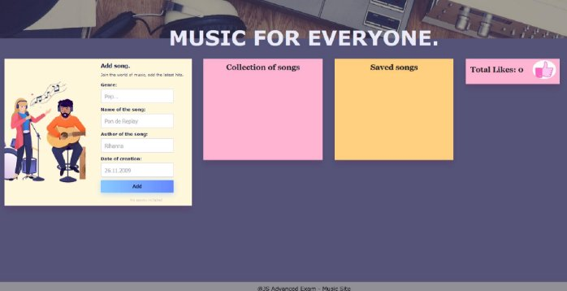

**Your Task** 

**Write the missing JavaScript code** to make the **Music Site** work as expected: 

- A**ll fields (genre, name, author, and date)** are **filled with the correct input** 
  - **Genre, name, author, and date** are **non**-**empty** **strings** 
- The program should not do anything if any of the input fields are empty. 

**1. Getting the information about a new song** 

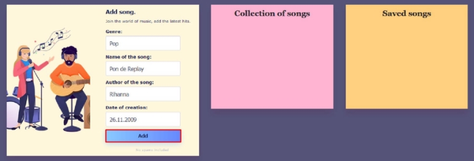

- When you click the **["Add"]** button, the information from the input fields must be added to the **div** with the **class** **"all-hits-container"** and then clear input fields.     

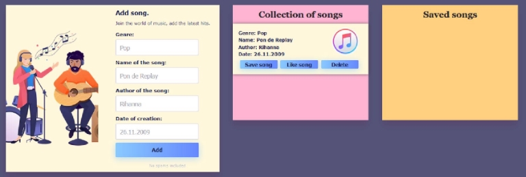

- The HTML structure looks like this: 

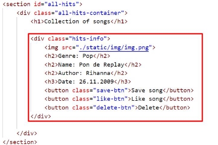

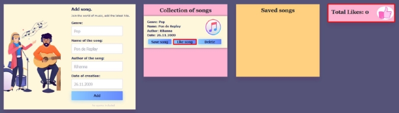

- When the **["Like song"]** button is clicked: 
- You need to take a value of the current number of **likes** inside the paragraph in the section with the id **"total-likes"** and increase the value by one. 

- The button **["Like song"]** for the current song must then be **disabled**, as the user has the right to like the song only once (Once the button is **disabled**, its color will turn gray). 

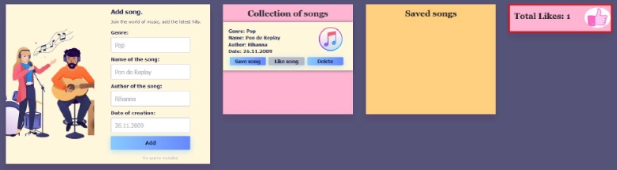

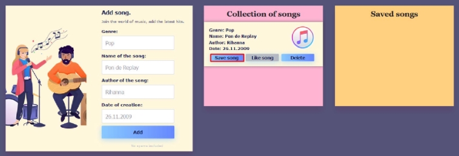

- When the **["Save song"]** button is clicked, you need to move the current song in the **div** with **class** **"saved- container"**.  

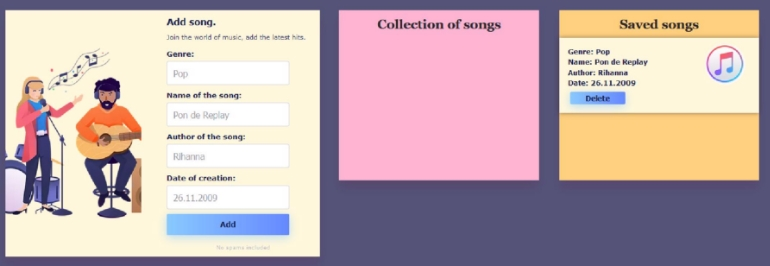

- The HTML structure looks like this: 

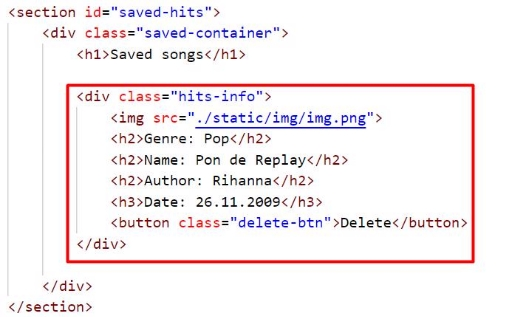

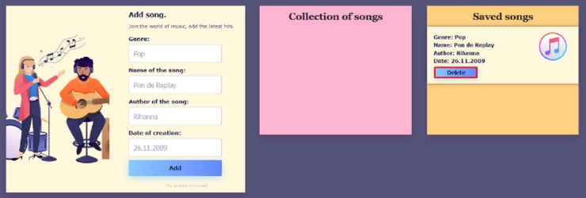

- When you click the **["Delete"]** button, the song should be removed from the current section. **Note:** When deleting a song, you should not reduce the value of the current number of likes. 

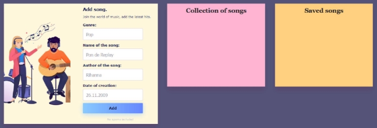

- The HTML structure looks like this: 

**Submission** 

Submit only your **solve()** function. 

*GOOD LUCK…* J* 
