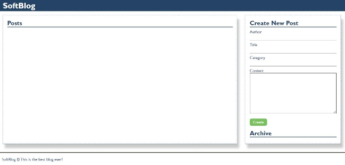
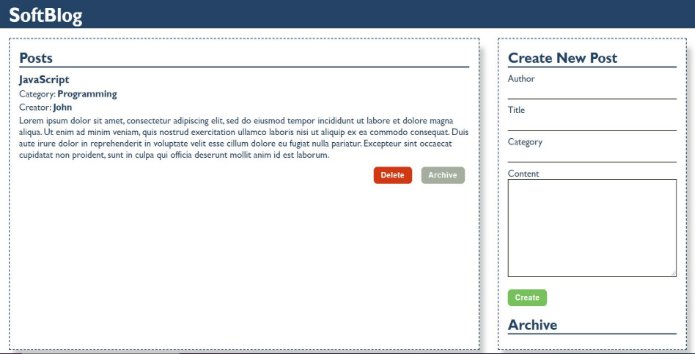
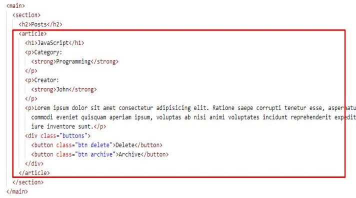
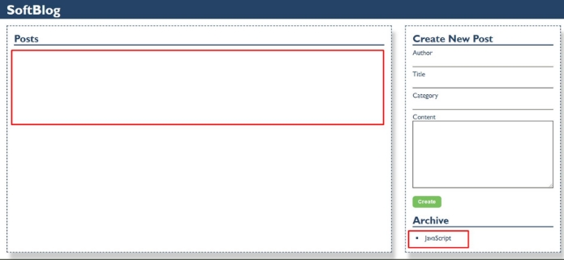
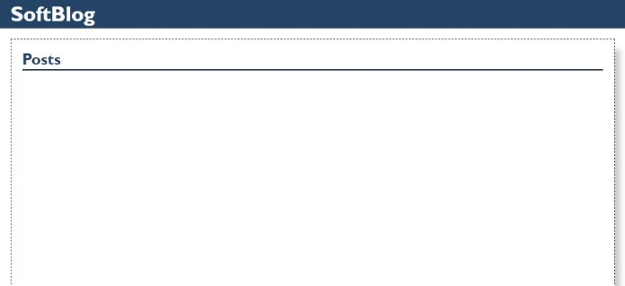


**1.  SoftBlog**

**Your Task** 

Write the missing JavaScript code to make the Blog application work as expected. You should be able to **create** new articles. 

Each article has **author, title, category** and **content**. When you click the **[Create]** button, a new **article item** should be added to the articles **section**.  

The new item should have the **following structure**: 

·  Append two buttons, which are in a **div** element with class **"buttons"** to each article item 

- **[Delete]** button should have the following classes: **"btn" and "delete"** 
- **[Archive]** button should have the following classes: **"btn" and "archive"** 

When you click the **[Archive]** button you should move the article to the **ol** in the archive section. Archive section should be **sorted by title**. 

**Important! Do not move the entire article, but only the title of the article.   **

When you click the **[Delete]** button you should delete the entire article.  

