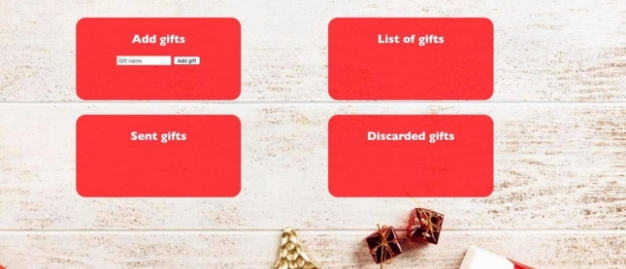
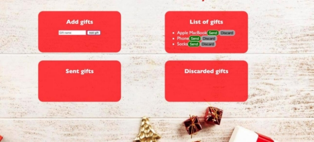
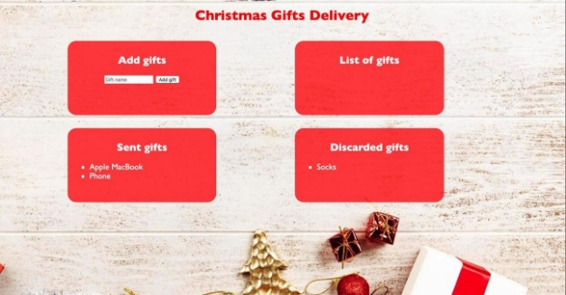


**JS Advanced: Retake Exam - 10.12.19** 

**Problem 1. Christmas Gifts Delivery (DOM Manipulation)** 

**Note:** You have **NO permission** to change directly the given HTML *(index.html file)*. 

**Your Task** 

Write the missing JavaScript code to make the Christmas Gifs Delivery application work as expected. You should be able to **add** new gifts to the list of gifts. 

Each product has **name**. When you click the **[Add gift]** button, a new **list item** should be added to the **List of gifts**. To each list item you should put a **class “gift”**. Upon clicking the **[Add gift]** button you should **sort** the gifts **in alphabetical order** and you should **clear the input field.** 

The new item should have the **following structure**: 

·  Append two buttons to each list item 

- Add class **“gift”** to each list item 
- **[Send]** button with id **“sendButton”** 
- **[Discard]** button with id **“discardButton”** 

When you click the **[Send]** button you should move the list item to the **Sent gifts** section. **Important!** Do not move the entire list item, but only the name of the gift. You should leave the buttons behind.  

When you click the **[Discard]** button you should move the list item to the **Discarded** gifts section. **Important!** Do not move the entire list item, but only the name of the gift. You should leave the buttons behind. 

