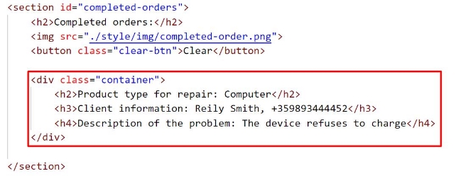

**JS Advanced Retake Exam** 

**Problem 1. Service** 

|**Environment Specifics** |
| - |
|Please, be aware that every JS environment may **behave differently** when executing code. Certain things that work |
|in the browser are not supported in **Node.js**, which is the environment used by **Judge**. |
|The following actions are **NOT** supported: |
|- **.forEach()** with **NodeList** (returned by **querySelector()** and **querySelectorAll()**) |
|- **.forEach()** with **HTMLCollection** (returned by **getElementsByClassName()** and **element.children**) |
|- Using the **spread-operator** (**...**) to convert a **NodeList** into an array |
|- **append()** in Judge (use only **appendChild()**) |
|- **replaceWith()** in Judge |
|- **replaceAll()** in Judge |
|- **closest()** in Judge |
|If you want to perform these operations, you may use **Array.from()** to first convert the collection into an array.  |
**Use the provided skeleton to solve this problem.**

**Note**: You **can't** and you have no permission to **change** directly the given HTML code (index.html file). 

**Your Task** 

**Write the missing JavaScript code** to make the **Service** work as expected: 

- All fields **(description, client name, and client phone)** are **filled with the correct input** 
- **Description, client name,** and **client phone** are **non**-**empty** **strings**. If any of them are empty, the program should not do anything. 
- **Note** that the possible values for the Product type are two - **Phone** and **Computer**. To see which **drop-down menu** option is **selected**, read its parent's properties: **value.** 

**1. Getting the information from the repair form** 

- When you click the **["Send form"]** button, the information from the input fields must be added to the **section** with the **id** **"received-orders"** and **then clear input fields**.     
- The HTML structure looks like this: 

**Note:** When an order is successfully added, the button **["Finish repair"]** must be **disabled**, as the order cannot be completed if it has not started (Once the button is **disabled**, its color will turn gray).** 

- When the **["Start repair"]** button is clicked, repair on the device begins. Since the process has already started, the worker will not be allowed to restart it, so the **["Start repair"]** button must be **disabled.** (Once the button is **disabled**, its color will turn gray). 
- Button **["Finish repair"]** must become activated. 

- When the **["Finish repair"]** button is clicked, repair on the device is complete. Therefore, you need to move the current device in the **section** with the **id** **"completed-orders"**. 

- The HTML structure looks like this: 

- When you click the **["Clear"]** button, you must **remove** all added **div** elements with **class** **"container"** from the section **Completed orders**. 

- The HTML structure looks like this: 

**Submission** 

Submit only your **solve()** function. 

*GOOD LUCK…* J* 
