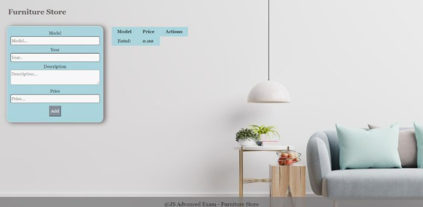
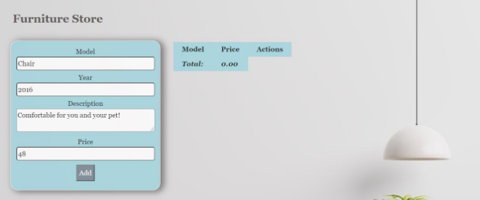
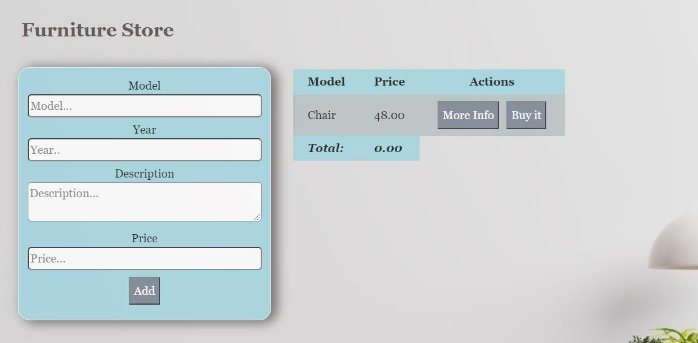
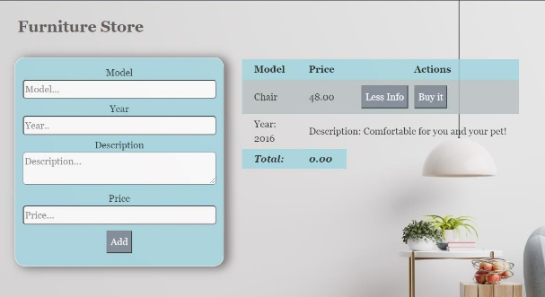
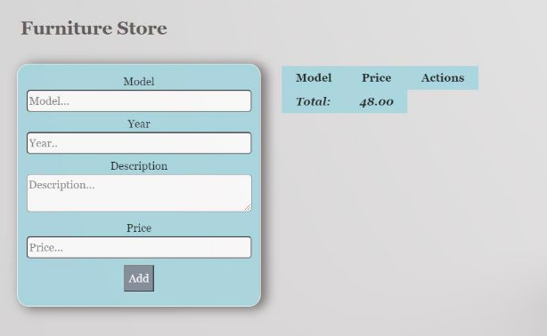

**JS Advanced Retake Final Exam** 

**Problem 1. Furniture Store** 

**Write the missing JavaScript code** to make the **Furniture** **Store** work as expected: 

**Your Task** 

- A**ll fields (model, year, description, and price)** are **filled with the correct input** 
- **Model and description** are **non**-**empty** **strings** 
- **Year** and **Price** need to be **positive** **numbers** 
- **All fields must be filled** 

**1. Getting the furniture information** 

- When you click the **“Add”** button, the information from the input fields must be added to the table and then clear input fields.                      
- The table contains **Model, Price of furniture** and **Actions** - **[More information], [Buy it]**.  **Price** must be **rounded** to **second** digit after decimal point. 

**Each furniture** must be appended to **"furniture-list"** and look like the picture below: 

Each furniture has main information line **(Model, Price)** and an additional information line. The additional information line stores **the description and year** of manufacture of the furniture **(hidden until the "More info" button is pressed**)**.** 

When the **"More Info"** button is clicked, change button text from **"More Info"** to **"Less Info"** and style display of **"class = hide"** from **"none "** to  **"contents".** The second **<td>** must have attribute **colspan** with value **3.** When click **"Less Info"** button is clicked, change button text from **"Less Info"** to **"More Info"** and style from **"contents "** to  **"none".** 

When the **"Buy it"** button is clicked, should have the following **functionality:**  

- **The current furniture** must be **removed from the row** in the table 
- You need to **change** the **total** profit in **the store.** Take the element with class **"total-price" and increase the current total price** **with** the **price of the furniture**. 

