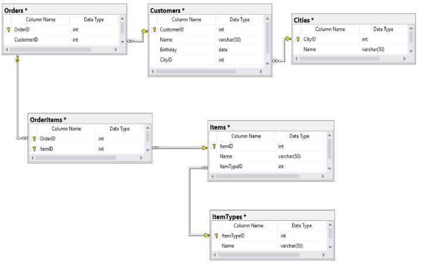
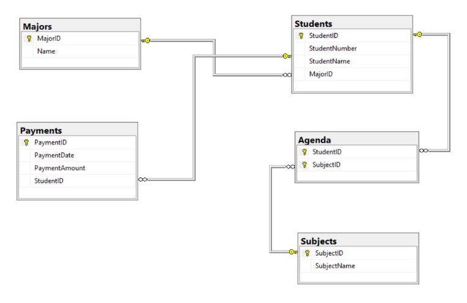


**Exercises: Table Relations** 

**Problem 1.  One-To-One Relationship** 

Create two tables as follows. Use appropriate data types. 

|**Persons** |
| - |
|**PersonID** |**FirstName** |**Salary** |**PassportID** |
|1   |Roberto          |`  `43300.00 |102 |
|2 |Tom |56100.00 |103 |
|3 |Yana |60200.00 |101 |

|**Passports** |
| - |
|**PassportID** |**PassportNumber** |
|101 |N34FG21B |
|102 |K65LO4R7 |
|103 |ZE657QP2 |
**Insert** the data from the example above. 

Alter the **customers** table and make **PersonID** a **primary key**. Create a **foreign key** between **Persons** and **Passports** by using **PassportID** column. 

**Problem 2.  One-To-Many Relationship** 

Create two tables as follows. Use appropriate data types. 

|**Models** |
| - |
|**ModelID** |**Name** |**ManufacturerID** |
|101 |X1 |1 |
|102 |i6 |1 |
|103 |Model S |2 |
|104 |Model X |2 |
|105 |Model 3 |2 |
|106 |Nova |3 |

|**Manufacturers** |
| - |
|**ManufacturerID** |**Name** |**EstablishedOn** |
|1   |BMW |07/03/1916 |
|2 |Tesla |01/01/2003 |
|3 |Lada |01/05/1966 |
**Insert** the data from the example above. Add **primary keys** and **foreign keys**. 

**Problem 3.  Many-To-Many Relationship** 

Create three tables as follows. Use appropriate data types. 

|**Students** |
| - |
|**StudentID** |**Name** |
|1   |Mila      |
|2 |Toni |
|3 |Ron |

|**Exams** |
| - |
|**ExamID** |**Name** |
|101 |SpringMVC |
|102 |Neo4j |
|103 |Oracle 11g |

|**StudentsExams** |
| - |
|**StudentID** |**ExamID** |
|1 |101 |
|1 |102 |
|2 |101 |
|3 |103 |
|2 |102 |
|2 |103 |
Insert the data from the example above. 

Add **primary keys** and **foreign keys**. Have in mind that table **StudentsExams** should have a **composite primary key**.

**Problem 4.  Self-Referencing**  

Create a single table as follows. Use appropriate data types. 

|**Teachers** |
| - |
|**TeacherID** |**Name** |**ManagerID** |
|101 |John |NULL |
|102 |Maya |106 |
|103 |Silvia |106 |
|104 |Ted |105 |
|105 |Mark |101 |
|106 |Greta |101 |
Insert the data from the example above. Add **primary keys** and **foreign keys**. The **foreign key** should be between **ManagerId** and **TeacherId**. 

**Problem 5.  Online Store Database** 

Create a new database and design the following structure: 

**Problem 6.  University Database** 

Create a new database and design the following structure: 

**Problem 7.  SoftUni Design **

Create an **E/R Diagram** of the SoftUni Database. There are some **special relations** you should **check out**: Employees are **self-referenced** (**ManagerID**) and Departments have **One-to-One** with the Employees (**ManagerID**) while the Employees have **One-to-Many** (**DepartmentID**). You might find it interesting how it looks on the diagram. J 

**Problem 8.  Geography Design** 

Create an **E/R Diagram** of the Geography Database. 

**Problem 9.  \*Peaks in Rila** 

Display **all peaks** for **"Rila"** mountain. Include: 

- **MountainRange** 
- **PeakName** 
- **Elevation** 

Peaks should be **sorted** by **elevation descending**. 

Example 

|**MountainRange** |**PeakName** |**Elevation** |
| - | - | - |
|Rila |Musala |2925 |
|… |… |… |
